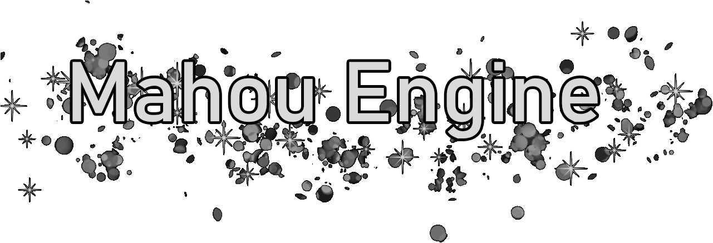
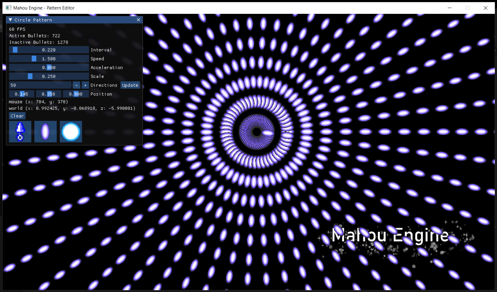

# Mahou Engine
Simple 2D/3D game engine based on OpenGL focused on Shoot 'em up games for study purpose.

- [x] Sprite render
- [x] Sprite Animation
- [x] Sprites with Alpha
- [x] Text render
- [x] Camera
- [x] Collision
- [x] Materials
- [x] Instancing
- [x] Lua scripting support
- [x] Tileset
- [x] 3D Models
- [ ] Post-processing
- [ ] Audio (BGM)
- [ ] Audio (SFX)
- [ ] Scene Editor

## Dependencies

For Windows users, install [cmake](https://cmake.org/), then run the `dependencies.bat` file in the scripts folder to download and compile all dependencies needed.

## Build

Run the `build.bat` file at the root of the project to compile the engine static library.
To compile any example, just run the `build.bat` of the example.

