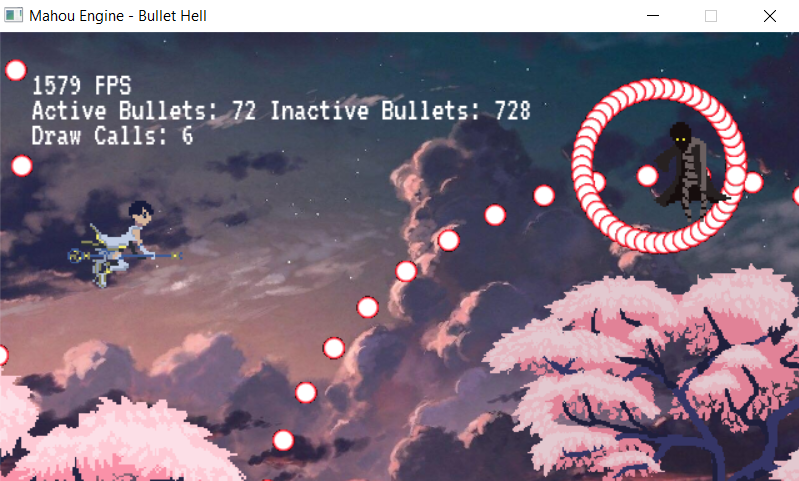

# Mahou Engine
Simple 2D/3D game engine based on SDL2/OpenGL

- [x] Sprite render
- [x] Sprite Animation
- [x] Sprites with Alpha
- [x] Affine transformation
- [x] Coroutine
- [x] Camera
- [x] Game entities
- [x] Scene
- [x] Text render
- [x] Collision Circle - Circle
- [x] Materials
- [x] Instancing
- [x] Lua scripting support
- [ ] UI Image layer
- [ ] Collision Circle - Rect
- [ ] Collision Rect - Rect (AABB)
- [ ] 3D Models

## Dependencies

For Windows users, install [msys2](https://www.msys2.org/) to enable make.

## Build

At your shell, run `make res` to build all resources and then run `make` to compile all the examples inside the [examples](examples/) folder.

