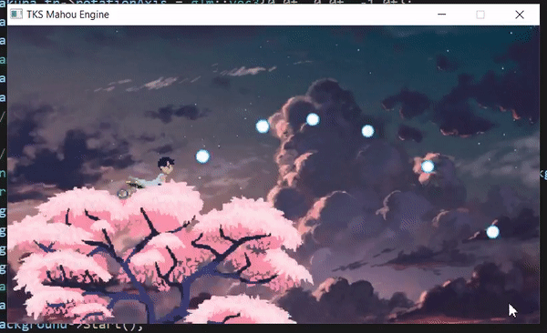

# TKS Mahou Engine
Engine 2D/3D para projetos futuros

- [x] Exibição de sprites
- [x] Animação de Sprites
- [x] Sprites com Alpha
- [x] Transformações Afins
- [x] Co-rotinas
- [x] Câmera
- [x] Entidade de jogo
- [x] Cena
- [x] Exibição de texto
- [ ] Imagens na camada UI
- [x] Colisão Circle - Circle
- [ ] Colisão Circle - Rect
- [ ] Modelos 3D
- [x] Materiais


## Instalação

Instale qualquer ferramenta que possibilite a utilização do make, de preferência o [msys2](https://www.msys2.org/).

## Como Buildar

Estando na pasta que contém o Makefile, execute:
```
make res
```
Tal comando irá compilar headers contendo os binários referentes a todos
os aquivos pngs (Caso seja necessário compilar outras extensões basta adicionar a regra no Makefile).

E depois:
```
make
```
Tal comando irá compilar todos os projetos que estiverem na pasta [examples](examples/),
criando uma pasta **build** contendo o executável e as dlls necessárias.


